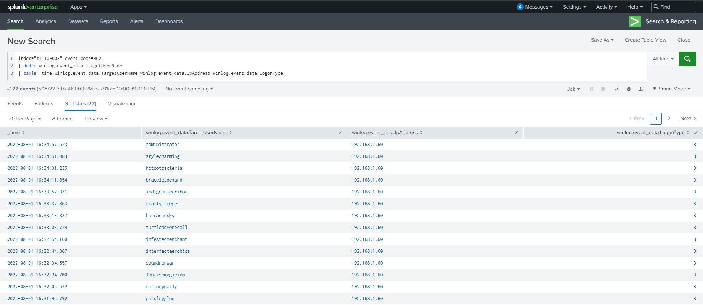
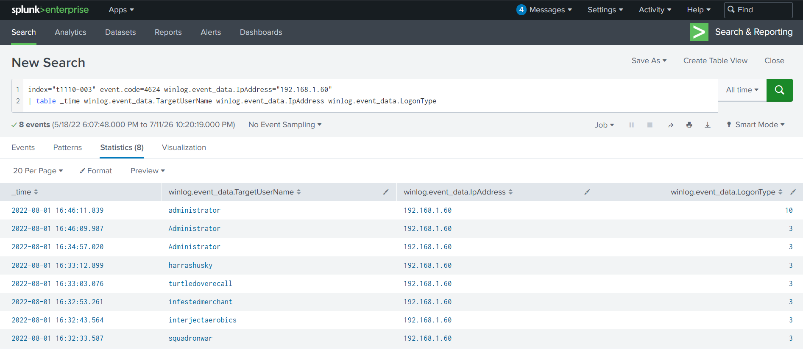
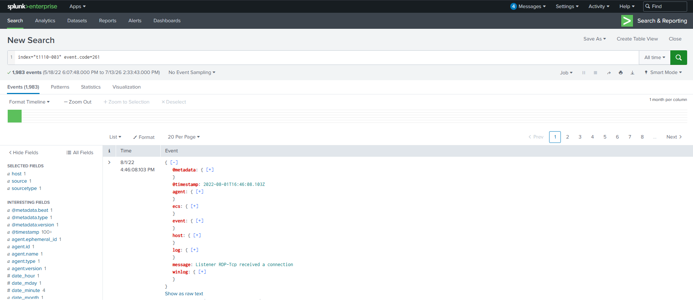

MITRE ATT&CK: T1110.003

Splunk

Windows Event Logs

SOC Investigation

# Password Spraying Investigation

## Overview

This project documents the investigation of a Password Spraying attack using Windows authentication logs in a simulated SOC environment. The objective was to identify the attack pattern, determine whether the attacker successfully authenticated, analyze account lockout behavior, and map the observed activity to the MITRE ATT&CK framework.

## Scenario

A suspected password spraying attack was detected against multiple user accounts within a Windows environment. Using authentication logs available in Splunk, the investigation focused on identifying the attack timeline, authentication attempts, successful logins, and security controls triggered during the attack.

## Objectives

- Detect password spraying activity.
- Analyze failed and successful authentication attempts.
- Identify the protocol targeted by the attacker.
- Determine account lockout behavior.
- Map attacker activity to the MITRE ATT&CK framework.
- Recommend defensive improvements.

## Environment

- Platform: CyberDefenders
- SIEM: Splunk
- Data Source: Windows Security Event Logs

## Investigation Process

### Step 1 – Review Failed Authentication Events

The investigation began by reviewing failed authentication events to determine whether multiple accounts were being targeted from a single source.

**Evidence**

> 
Event ID 4625 revealed multiple failed network logon attempts originating from the same source IP address (192.168.1.60) and targeting numerous unique user accounts. This pattern is consistent with a password spraying attack, where a single password is attempted against multiple accounts.
---

### Step 2 – Analyze Successful Authentication

After identifying suspicious failed authentication attempts, the investigation focused on determining whether the attacker successfully authenticated to the target system. Successful logon events were reviewed to identify compromised accounts and assess the impact of the attack.

**Evidence**

> 
Event ID 4624 identified successful logon events originating from the same source IP address (192.168.1.60) observed during the failed authentication attempts. This confirms that the attacker eventually authenticated successfully after the password spraying activity.
---

### Step 3 – Identify the Targeted Protocol

The authentication events were further analyzed to determine which network protocol was targeted during the password spraying attack. Identifying the protocol helps understand the attack vector and supports the overall investigation.

**Evidence**

> 
Analysis of the authentication events identified [RDP] as the protocol targeted during the password spraying attack.

## Key Findings

| Finding | Result |
|---------|--------|
| Attack Technique | Password Spraying (MITRE ATT&CK T1110.003) |
| Source IP Address | 192.168.1.60 |
| Targeted Protocol | RDP |
| Failed Authentication Event | Windows Event ID 4625 |
| Successful Authentication Event | Windows Event ID 4624 |
| Successfully Authenticated Accounts | 6 user accounts |
| Attack Duration | 05:48 |
| Re-authentication Interval | 11 minutes |
| Account Lockout Policy | Account Lockout |
| Event ID 4625 Sub Status | User logon with misspelled or bad password |

## MITRE ATT&CK Mapping

| Technique ID | Technique | Description |
|--------------|-----------|-------------|
| T1110.003 | Password Spraying | The attacker attempted to authenticate against multiple user accounts using a common password to obtain valid credentials. |

## Indicators of Compromise (IOCs)

| IOC Type | Value |
|----------|-------|
| Source IP | 192.168.1.60 |
| Technique | Password Spraying (T1110.003) |
| Failed Logon Event | Event ID 4625 |
| Successful Logon Event | Event ID 4624 |
| Targeted Protocol | RDP |

## Detection Opportunities

- Alert on multiple failed logon attempts (Event ID 4625) originating from the same source IP.
- Detect authentication attempts targeting multiple user accounts within a short period.
- Correlate Event IDs 4625 and 4624 to identify successful authentication following repeated failures.
- Monitor Remote Desktop (RDP) authentication activity from unusual hosts.

## Recommendations

- Enable Multi-Factor Authentication (MFA) for all remote access services.
- Configure and enforce a strong account lockout policy.
- Monitor Windows Event IDs 4625 and 4624 for abnormal authentication activity.
- Create SIEM detection rules to identify multiple failed logon attempts targeting different user accounts from the same IP address.
- Restrict Remote Desktop Protocol (RDP) access to trusted networks whenever possible.
- Review privileged accounts regularly and enforce strong password policies.

## Lessons Learned

- Password spraying attacks differ from traditional brute-force attacks by targeting multiple accounts with a common password.
- Correlating failed (Event ID 4625) and successful (Event ID 4624) authentication events is essential for identifying compromised accounts.
- Authentication logs provide valuable evidence for reconstructing attack activity and identifying attacker behavior.
- Monitoring authentication patterns and implementing preventive controls can significantly reduce the risk of password spraying attacks.

## References

- CyberDefenders – T1110.003 Password Spraying Lab
- MITRE ATT&CK – T1110.003 Password Spraying
- Microsoft Documentation – Event ID 4625
- Microsoft Documentation – Account Lockout Policy
